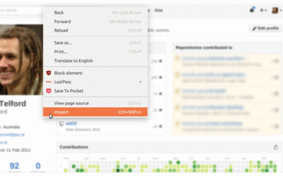

# Extract to React Chrome DevTools Plugin

[](https://www.bithound.io/github/jesstelford/extract-to-react/master/dependencies/npm)

Chrome/Chromium extension for easy HTML to React conversion.



Extract all the HTML & CSS of any portion of any website directly into a
ready-to-go React Component!

## Installation

Grab it from Google: [Extract to React](https://chrome.google.com/webstore/detail/extract-to-react/fbdmadiknkkdfcgjdbmddklighibfomm?hl=en-US&gl=AU)

## Usage

### Quick start

Inspect an element on the page > "Extract To React" tab > Extract the code to
CodePen or JSFiddle.

### Advanced usage

It is possible to split a monolithic component up into multiple nested
components.

Find the elements you wish to become their own component in the "Elements" tab.
Add an attribute called `data-component`.  Set the value of `data-component` to
be the extracted name of the component:

```html
<h1 class="heading" data-component="Heading">Hello, world!</h1>

<nav class="nav" data-component="Nav">
  <ul class="list">
    <li class="list-item" data-component="ListItem">#1</li>
    <li class="list-item" data-component="ListItem">#2</li>
  </ul>
</nav>
```
        
Will result in 3 components being extracted: `Heading`, `Nav`, and `ListItem`

## Building From Source

```bash
git clone https://github.com/jesstelford/extract-to-react.git
cd extract-to-react
npm install
npm run build
```

Now load as an `Unpacked extension` via chrome extensions page. Point to the
`extract-to-react/lib` folder for the compiled extension.

# Bugs and Features

If you found a bug or have a feature request, please create an issue here on
GitHub.

https://github.com/jesstelford/extract-to-react/issues

# Attribution

This project is based on excellent open source software:

* **[SnappySnippet](https://github.com/kdzwinel/SnappySnippet/issues)**:
  Chrome/Chromium extension that allows easy CSS+HTML extraction of specific DOM
  element. Created snippet can be then exported to CodePen, jsFiddle or JS Bin
  with one click.
* **[`html-to-react-components`](https://roman01la.github.io/html-to-react-components/)**:
  Extract annotated portions of HTML into React components as separate modules

# License

Ugh... The GPL virus has infected this codebase :/

This program is free software: you can redistribute it and/or modify
it under the terms of the GNU General Public License as published by
the Free Software Foundation, either version 3 of the License, or
(at your option) any later version.

This program is distributed in the hope that it will be useful,
but WITHOUT ANY WARRANTY; without even the implied warranty of
MERCHANTABILITY or FITNESS FOR A PARTICULAR PURPOSE.  See the
GNU General Public License for more details.

You should have received a copy of the GNU General Public License
along with this program.  If not, see <http://www.gnu.org/licenses/>.
